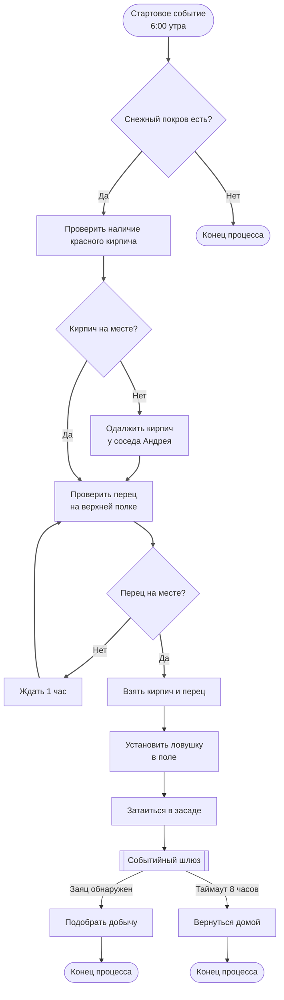

```mermaid
flowchart TB
    start([Стартовое событие\n6:00 утра]) --> checkSnow{Снежный покров есть?}
    checkSnow -->|Да| checkBrick[Проверить наличие красного кирпича]
    checkSnow -->|Нет| end1([Конец процесса])
    
    checkBrick --> brickDecision{Кирпич на месте?}
    brickDecision -->|Нет| borrowBrick[Одалжить кирпич\nу соседа Андрея]
    borrowBrick --> checkPepper
    brickDecision -->|Да| checkPepper[Проверить перец\nна верхней полке]
    
    checkPepper --> pepperDecision{Перец на месте?}
    pepperDecision -->|Нет| waitHour[Ждать 1 час] --> checkPepper
    pepperDecision -->|Да| prepareTrap[Взять кирпич и перец]
    
    prepareTrap --> setTrap[Установить ловушку\nв поле] --> hide[Затаиться в засаде]
    
    hide --> eventGateway[[Событийный шлюз]]
    eventGateway -->|Заяц обнаружен| catchHare[Подобрать добычу] --> end2([Конец процесса])
    eventGateway -->|Таймаут 8 часов| returnEmpty[Вернуться домой] --> end3([Конец процесса])
    
    %% Координатные привязки
    linkStyle 0 stroke:#555,stroke-width:2px
    linkStyle 1 stroke:#555,stroke-width:2px
    linkStyle 2 stroke:#555,stroke-width:2px
    linkStyle 3 stroke:#555,stroke-width:2px
    linkStyle 4 stroke:#555,stroke-width:2px
    linkStyle 5 stroke:#555,stroke-width:2px
    linkStyle 6 stroke:#555,stroke-width:2px
    linkStyle 7 stroke:#555,stroke-width:2px
    linkStyle 8 stroke:#555,stroke-width:2px
    linkStyle 9 stroke:#555,stroke-width:2px
    linkStyle 10 stroke:#555,stroke-width:2px
```
